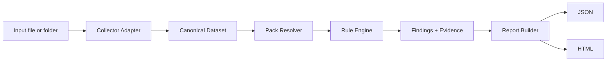

# PAL 2026 Phase 1 Technical Specification

## Purpose

This document turns the PAL 2026 modernization plan into an implementation-ready specification for **Phase 1: Engine MVP**.

Phase 1 is intentionally narrow.

We are not building a full observability platform yet.
We are building a modern, reliable, testable core that can:

- ingest captured Windows performance counter data
- normalize it into a stable internal model
- evaluate versioned rules from packs
- generate deterministic findings
- emit machine-readable and human-readable reports
- run locally from a CLI without requiring a web app

This phase preserves the historical value of PAL while fixing the biggest architectural limitation of the legacy tool: too much logic tied to a monolithic desktop workflow.

---

## Goals

### In scope
- BLG import via a collector adapter
- CSV import for normalized or exported counter data
- internal canonical dataset model
- pack schema v1
- rule evaluation engine v1
- report schema v1
- CLI contract v1
- HTML report output
- JSON report output
- deterministic offline execution
- test fixtures and golden outputs
- Windows-first support

### Out of scope
- web UI
- multi-user API service
- cloud-hosted storage
- anomaly detection
- ETW trace parsing
- event log correlation
- OpenTelemetry ingestion
- SQL DMV ingestion
- scheduling or background workers
- automatic data collection from remote hosts

---

## Non-goals

Phase 1 is not trying to:
- replace PerfView or Windows Performance Analyzer
- become a SIEM or APM
- infer root cause with AI
- support every legacy PAL threshold file without transformation
- deliver perfect parity with the old UI

---

## Product principles

### 1. Local-first
Phase 1 must work fully offline on a single workstation.

### 2. Deterministic
Given the same dataset, the same pack versions, and the same CLI options, the findings must be identical.

### 3. Packs are content
Rules, thresholds, product mappings, and explanatory text live in packs, not hard-coded logic.

### 4. Engine is headless
All core logic must run without a GUI.

### 5. Explain every finding
A finding without evidence and rationale is not acceptable.

### 6. Preserve evidence
Every finding must point back to the time series, rollup, and rule condition that triggered it.

---

## Phase 1 deliverables

1. `pal-engine`
   - normalization
   - rule execution
   - scoring
   - finding generation

2. `pal-collectors`
   - BLG adapter
   - CSV adapter

3. `pal-packs`
   - schema v1
   - starter packs:
     - Windows OS core
     - IIS core
     - SQL Server core host counters

4. `pal-reporting`
   - JSON result writer
   - HTML report writer

5. `pal-cli`
   - analyze command
   - validate-pack command
   - inspect-dataset command
   - list-packs command

6. test harness
   - fixture corpus
   - golden snapshots
   - rule-level unit tests
   - pack validation tests

---

## Proposed repository structure

```text
/pal
  /src
    /Pal.Core
    /Pal.Collectors.Blg
    /Pal.Collectors.Csv
    /Pal.Packs
    /Pal.Reporting
    /Pal.Cli
  /packs
    /windows-core
    /iis-core
    /sql-host-core
  /fixtures
    /healthy-server
    /cpu-pressure
    /memory-pressure
    /disk-latency
    /sql-bottleneck
  /docs
  /tests
    /Pal.Core.Tests
    /Pal.Collectors.Tests
    /Pal.Reporting.Tests
    /Pal.PackValidation.Tests
```

---

## Target runtime and implementation constraints

### Platform
- .NET 8 LTS
- Windows as the supported execution platform for Phase 1
- Linux/macOS may run non-BLG portions later, but are not required for Phase 1 acceptance

### Language
- C#

### Storage
- no database required in Phase 1
- all analysis runs are file-based

### Packaging
- self-contained CLI build for Windows x64
- optional framework-dependent build
- packs distributed as directories or signed zip bundles

---

## Core execution flow



---

## Domain model

Phase 1 depends on a strict internal model.

### Entity: Dataset
A dataset is the fully imported and normalized input for one analysis run.

Required fields:
- `dataset_id`
- `source_type` (`blg`, `csv`)
- `source_path`
- `imported_at_utc`
- `machine_name` if available
- `time_zone` if known
- `start_time_utc`
- `end_time_utc`
- `sample_interval_seconds`
- `series[]`
- `metadata`

### Entity: TimeSeries
A time series represents a single metric stream.

Required fields:
- `series_id`
- `counter_path_original`
- `counter_path_canonical`
- `object_name`
- `counter_name`
- `instance_name` nullable
- `machine_name`
- `unit`
- `samples[]`
- `statistics`

### Entity: Sample
Required fields:
- `timestamp_utc`
- `value`
- `quality` (`good`, `missing`, `invalid`, `interpolated`)

### Entity: SeriesStatistics
Precomputed statistics used by rules and reporting.

Required fields:
- `count`
- `min`
- `max`
- `avg`
- `median`
- `p90`
- `p95`
- `p99`
- `stddev`
- `duration_over_thresholds` optional map
- `missing_sample_count`

### Entity: Pack
A versioned content bundle that declares:
- applicability
- metric aliases
- rules
- narratives
- severities
- references

### Entity: Rule
A rule evaluates one or more metric conditions and emits zero or more findings.

### Entity: Finding
A finding is a single diagnostic statement produced by the engine.

Required fields:
- `finding_id`
- `rule_id`
- `pack_id`
- `severity`
- `category`
- `title`
- `summary`
- `explanation`
- `evidence`
- `time_window`
- `affected_series[]`
- `recommendations[]`

---

## Canonical counter identity model

Legacy PerfMon naming is inconsistent across:
- localization
- instance formatting
- machine name prefixes
- SQL named instances
- differing export formats

Phase 1 must normalize counters into a canonical key.

Canonical form:

```text
{product_namespace}.{object_name}.{counter_name}[instance={instance_name}]
```

Examples:

```text
windows.processor.% processor time[instance=_Total]
windows.memory.available mbytes
windows.logicaldisk.avg. disk sec/read[instance=C:]
sql.buffer manager.page life expectancy
iis.web service.current connections[instance=_Total]
```

Rules:
- lowercase all canonical tokens
- trim whitespace
- preserve instance case only if required for uniqueness, otherwise lowercase
- remove machine prefix from canonical path
- preserve original path separately for traceability
- map known aliases through pack-provided alias tables

---

## Ingestion requirements

### BLG collector
The BLG collector must:
- read one or more BLG files
- extract all available counters and timestamps
- preserve original counter paths
- infer sample interval
- flag gaps and malformed samples
- expose machine name and log metadata if available

Acceptance notes:
- must handle at least 1 million samples without crashing
- must stream where practical instead of loading everything eagerly if memory pressure is high
- should fail with precise, user-actionable errors

### CSV collector
The CSV collector must support:
- PAL-export-compatible CSV if available
- generic normalized CSV with explicit schema
- configurable timestamp parsing
- optional counter-path mapping file

Minimum generic CSV columns:
- `timestamp`
- `counter_path`
- `value`

Optional columns:
- `machine_name`
- `instance_name`
- `quality`
- `unit`

---

## Normalization pipeline

The normalization pipeline executes these steps in order:

1. parse raw input
2. validate timestamps
3. normalize counter identities
4. attach known units
5. sort samples by timestamp
6. collapse duplicate samples using deterministic rules
7. compute statistics
8. detect gaps and missingness
9. emit canonical dataset

### Duplicate sample rule
If duplicate timestamps exist for the same series:
- retain the last non-invalid sample by default
- log duplicate count in dataset warnings
- expose an override in collector options later, not in Phase 1 CLI

### Gap detection
A gap exists when elapsed time between samples exceeds:

```text
expected_interval * 1.5
```

Gaps must be reflected in:
- dataset warnings
- series missingness stats
- finding evidence where relevant

---

## Rule engine specification

Phase 1 rule engine supports deterministic threshold evaluation.

### Rule types in Phase 1
1. single-series threshold
2. sustained-duration threshold
3. ratio or comparison threshold
4. compound condition across multiple series
5. absence rule for required counters

### Phase 1 expression model
Use a constrained expression grammar, not arbitrary code.

Supported operations:
- comparison: `>`, `>=`, `<`, `<=`, `==`, `!=`
- boolean: `and`, `or`, `not`
- arithmetic: `+`, `-`, `*`, `/`
- aggregation functions:
  - `avg(series)`
  - `min(series)`
  - `max(series)`
  - `median(series)`
  - `p90(series)`
  - `p95(series)`
  - `p99(series)`
  - `duration_over(series, threshold)`
  - `percent_time_over(series, threshold)`
  - `latest(series)`

Future phases may add rolling-window functions. They are out of scope for Phase 1.

### Evaluation model
Each rule declares:
- applicability filters
- required metrics
- one or more conditions
- severity mapping
- finding template

A rule only executes if:
- the pack is selected or auto-resolved
- required metrics are present unless the rule is an absence rule
- the applicability filter passes

### Severity levels
Phase 1 severities:
- `critical`
- `warning`
- `informational`

No numeric severity is exposed publicly in Phase 1, but internal ordering may map to 3, 2, 1.

### Finding categories
Phase 1 categories:
- `cpu`
- `memory`
- `disk`
- `network`
- `process`
- `iis`
- `sql`
- `system`
- `collection`
- `pack-validation`

---

## Recommendation model

Each rule may emit recommendations.

Recommendation fields:
- `id`
- `priority` (`high`, `medium`, `low`)
- `text`
- `rationale`
- `links[]` optional
- `next_collection[]` optional

Recommendations must be static content from the pack in Phase 1.
No generated recommendations.

---

## Report generation requirements

### JSON output
JSON is the source of truth.
HTML is a rendering of the JSON result plus optional charts.

The JSON result must include:
- run metadata
- dataset summary
- selected packs
- warnings
- findings
- series summaries
- report-level score summary
- engine version
- pack versions

### HTML output
The HTML report must include:
- analysis summary
- environment metadata
- top findings
- findings grouped by category
- charts for triggered metrics
- missing counter warnings
- pack and engine version details

### Chart requirements
Phase 1 charts should be simple:
- static SVG or embedded JS-free rendering preferred
- line charts for triggered series
- optional threshold overlay
- limit chart count to avoid huge files

---

## Scoring

Phase 1 scoring is secondary to findings but useful for triage.

### Rule score contribution
Each triggered finding contributes a weighted value:
- critical = 30
- warning = 10
- informational = 2

### Category score
Category score is the sum of triggered findings in that category, capped at 100.

### Overall score
Overall health score:

```text
100 - min(100, weighted_penalty_sum)
```

This is a convenience score only.
Reports must clearly state that findings and evidence matter more than the single number.

---

## Pack resolution

Phase 1 pack selection modes:

### Explicit
User specifies one or more pack IDs.

### Auto
Engine selects packs based on:
- dataset counters present
- pack applicability patterns
- optional product hints from CLI

### Default behavior
If user does not specify packs:
- engine loads `windows-core`
- engine attempts auto-resolution for IIS and SQL packs

---

## Error handling requirements

Errors must be categorized:

### User errors
Examples:
- input file missing
- unsupported file type
- invalid pack schema
- output directory not writable

### Data errors
Examples:
- malformed timestamps
- empty dataset
- incompatible CSV format

### Engine errors
Examples:
- expression parse failure
- chart rendering failure
- unexpected null series stats

Requirements:
- non-zero exit codes
- concise console error
- optional verbose stack trace with `--verbose`
- partial warnings must not fail the run unless fatal

---

## Logging requirements

CLI logs must support:
- default human-readable console output
- `--verbose`
- `--log-file`

Minimum logged milestones:
- collector start/end
- normalization start/end
- pack resolution result
- rules executed count
- findings emitted count
- report write result

---

## Test strategy

### Unit tests
- expression parsing
- canonicalization
- stats computation
- severity mapping
- recommendation rendering

### Pack validation tests
- schema compliance
- missing metrics references
- duplicate IDs
- broken templates
- invalid severity values

### Fixture tests
For each fixture:
- run analysis
- compare JSON output against golden file
- allow stable versioned deltas only

### Performance tests
Target dataset:
- 100 counters
- 50,000 timestamps
- 5 million total samples

Minimum target:
- complete analysis in a practical local workstation timeframe
- memory use bounded and measurable
- no catastrophic slowdown on large logs

---

## Acceptance criteria

Phase 1 is complete when all of the following are true:

1. User can run a single CLI command against a BLG or supported CSV file.
2. Engine produces a JSON report and HTML report.
3. Packs can be selected explicitly or auto-resolved.
4. At least 20 useful starter rules exist across Windows, IIS, and SQL host coverage.
5. Findings include evidence, explanation, and recommendations.
6. Pack validation catches malformed or unsafe pack content before runtime.
7. Golden test fixtures pass consistently in CI.
8. Output is good enough to review in a real troubleshooting case.

---

## Suggested starter rules for Phase 1

### Windows core
- sustained CPU saturation
- low available memory
- high paging activity
- sustained disk read latency
- sustained disk write latency
- low disk free space if available in dataset
- high processor queue length
- excessive context switches

### IIS core
- high current connections
- request queue growth
- worker process CPU saturation
- worker process private bytes growth

### SQL host core
- low page life expectancy
- high batch requests with high CPU
- high lazy writes
- memory pressure indicators
- storage latency affecting database files

---

## Migration note for legacy PAL content

Legacy PAL threshold files should not be executed directly in Phase 1.

Instead:
1. parse and inventory legacy threshold definitions
2. manually or semi-automatically translate them to pack schema v1
3. validate semantic equivalence
4. version the translated packs independently

This is important.
We are modernizing the engine, not carrying old assumptions forward without review.

---

## Open design decisions

These need final decisions before build freeze:

1. exact BLG parsing library or interop strategy
2. HTML chart renderer choice
3. pack signing strategy, if any, in Phase 1 or deferred
4. whether to support localization alias tables in core or pack layer
5. whether JSON output should include every raw sample or only referenced/summary data

### Recommended decisions
- defer pack signing to Phase 1.5 unless distribution risk demands it
- keep raw sample inclusion optional and disabled by default
- put localization aliases in pack content, not core engine
- keep charts static and simple

---

## Implementation order

1. canonical dataset model
2. CSV collector
3. stats computation
4. expression parser
5. pack schema validator
6. rule engine
7. JSON report writer
8. HTML report writer
9. BLG collector
10. pack starter content
11. fixture and golden testing

That order keeps the engine testable even before BLG ingestion is complete.
