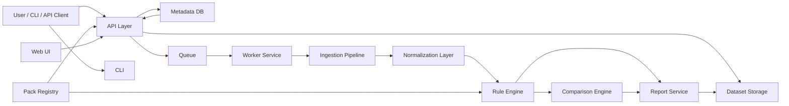

# PAL 2026 Reference Architecture

## High-Level Architecture

## Component Notes

### API Layer
Receives uploads, creates analysis runs, exposes status/results, and serves artifacts.

### Dataset Storage
Stores raw uploaded bundles and generated report artifacts.

### Metadata DB
Stores datasets, runs, pack versions, findings summaries, baselines, and comparison metadata.

### Queue + Worker
Allows larger analyses to run asynchronously and scales independently from the API.

### Ingestion Pipeline
Parses BLG, CSV, JSON, and bundle contents into normalized internal series.

### Normalization Layer
Maps source-specific identities into canonical names to improve rule reuse.

### Rule Engine
Applies pack rules and produces findings with evidence, severity, and narrative.

### Comparison Engine
Supports baseline and run-to-run diff analysis.

### Report Service
Generates JSON, Markdown, HTML, and compact ticket-oriented outputs.

### Pack Registry
Stores and validates rule packs and tracks compatible versions.

## Suggested Repositories / Projects

- `pal-core`
- `pal-api`
- `pal-web`
- `pal-cli`
- `pal-packs`
- `pal-fixtures`

## Suggested Deployment Modes

### Local-only mode
- CLI + local file outputs
- no server required

### Team self-hosted mode
- Docker Compose or Kubernetes
- API + worker + web + Postgres + object storage

### Managed SaaS mode
- hosted control plane
- org/project separation
- pack/channel updates
